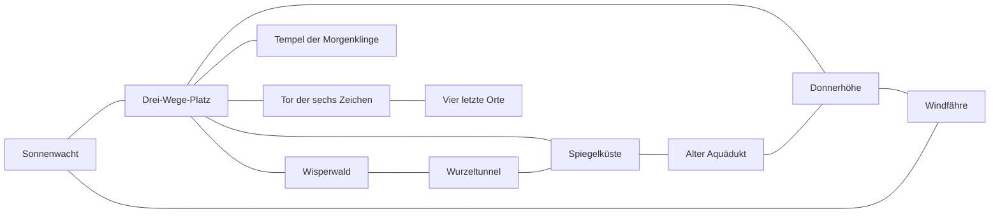

# Die Morgenklinge von Talora — Erzähl- und Weltbibel

Status: erste vollständige Erzählfassung für TextDungeon.

Prüfstand: 5. September 2026. Die Haupthandlung und Weltstruktur sind ausgearbeitet. Diese Fassung ist eine Produktionsgrundlage; vollständige Raumtexte, konkrete Rätselzustände und Kampfwerte folgen bei der Umsetzung. Verbindliche Passagen und ihre Freigaben stehen in Abschnitt 16.

Diese Erzähl- und Weltbibel beschreibt die Haupthandlung, Weltgeschichte, Figuren, drei Gabenquests, drei Wächterbosse, den Weltboss, 41 Schauplätze, wichtige Gegenstände und die Regeln für deutsche Spieltexte. Die Geschichte ist für Kinder von 8 bis 12 Jahren gedacht und soll besonders für ein aufmerksames zehnjähriges Kind spannend und verständlich sein.

## 1. Kurzfassung

Im Land Talora bleibt eines Morgens der Sonnenaufgang blass. Farben verschwinden, Wegweiser werden leer und drei alte Wächter greifen plötzlich die Orte an, die sie eigentlich beschützen sollen.

Du hilfst in der Kartenstube von Sonnenwacht. Als ein alter Messingkompass namens Kuno zum Leben erwacht, führt er dich zum Tempel der Morgenklinge. Dort liegt eine heilige Waffe hinter drei dunklen Zeichen. Um sie zu erwecken, musst du in der offenen Welt drei Gaben erschaffen:

- den **Sonnenfunken**;
- die **Quellträne**;
- das **Windlied**.

Mit der Morgenklinge kannst du die drei verdorbenen Wächter von einem Schattenpanzer befreien. Jeder übergibt dir danach ein altes Bannzeichen:

- das **Wurzelsiegel**;
- das **Gezeitensiegel**;
- das **Himmelssiegel**.

Erst die Morgenklinge und alle drei Siegel öffnen das Tor unter Sonnenwacht. Dahinter wartet **Raugrim, der Schatten unter der Welt**. Er kann nicht getötet werden. Im letzten Kampf setzt du die drei Siegel ein, brichst seine Schattenhülle mit der Morgenklinge und verbannst ihn erneut.

## 2. Identität der Kampagne

**Arbeitstitel:** *Die Morgenklinge von Talora*

**Genre:** Fantastisches Erkundungsabenteuer mit Rätseln, Gegenständen und rundenbasierten Kämpfen.

**Spielerfantasie:** Du bist kein vorherbestimmter Superheld. Du wirst zur Heldin oder zum Helden, weil du genau hinschaust, anderen hilfst, Hinweise verbindest und erkennst, wann du kämpfen und wann du besser umkehren solltest.

**Stimmung:** Farbenfroh, geheimnisvoll und manchmal unheimlich. Auf ernste Entdeckungen folgen freundliche Figuren, überraschende Tiere, schöne Aussichten oder ein trockener Kommentar von Kuno.

**Zentrale Themen:**

- Eine starke Waffe reicht nicht ohne Wissen und Freunde.
- Mut bedeutet auch, eine Gefahr zu erkennen und später zurückzukehren.
- Alte Geschichten können wahr sein und trotzdem wichtige Teile vergessen haben.
- Wer einen Ort repariert, verändert mehr als nur einen Schalter.
- Die Welt wird geschützt, wenn viele ihre Aufgabe übernehmen.

## 3. Das Land Talora

Talora liegt zwischen Meer, Wald und hohen Bergen. Von der alten Festung Sonnenwacht führen drei grosse Wege in unterschiedliche Regionen:

- westlich in den **Wisperwald**;
- südlich an die **Spiegelküste**;
- nördlich auf die **Donnerhöhe**.

In der Mitte steht der Tempel der Morgenklinge. Gleich daneben ragt das Tor der sechs Zeichen aus dem Boden. Jeder in Sonnenwacht kennt das Tor. Niemand hat es je geöffnet.

Talora war nie ein riesiges Königreich. Es ist ein Netz aus Dörfern, Werkstätten, Häfen, Gärten und alten Wachorten. Die Menschen der drei Regionen brauchen einander:

- Der Wald liefert Heilpflanzen, Früchte und Holz.
- Die Küste bringt Wasser, Salz, Glas und Nachrichten aus der Ferne.
- Die Berge liefern Metall, Windkraft und Maschinen.

Diese Verbindungen werden im Spiel sichtbar. Gegenstände für eine Aufgabe stammen oft aus mehr als einer Region. So fühlt sich Talora wie eine gemeinsame Welt und nicht wie drei getrennte Level an.

## 4. Raugrim und der Grauschleier

Tief unter Talora liegt eine Spalte, die älter als die Berge ist. Dort schläft Raugrim.

Raugrim ist kein gewöhnlicher Drache. Sein Körper besteht aus schwarzem Nebel, einzelnen Schuppen und Lücken, in denen Licht verschwindet. In alten Texten wird er **der Schatten unter der Welt** genannt.

Raugrim fürchtet Veränderung. Für ihn bedeutet jede neue Freundschaft, jeder neue Weg und jede neue Geschichte, dass etwas später verloren gehen kann. Deshalb will er Talora in einen stillen, grauen Augenblick einschliessen, in dem nichts mehr wächst, reist oder sich verabschieden muss.

Seine Kraft erscheint als **Grauschleier**:

- Farben werden schwach.
- Namen verschwinden von Schildern und Karten.
- Wege scheinen länger oder führen im Kreis.
- Tiere und Maschinen vergessen ihre Aufgabe.
- Eine traurige Idee wird so stark, dass sie alles andere verdrängt.

Der Grauschleier kann einen guten Wunsch verdrehen. Aus Schutz wird Gefangenschaft. Aus Erinnerung wird Festhalten. Aus Aufmerksamkeit wird Kontrolle. Genau das geschieht mit den drei Wächtern.

Raugrim kann sprechen, aber er lügt selten direkt. Er nimmt eine halbe Wahrheit und macht sie so gross, dass kein Platz für Hoffnung bleibt:

> «Alles, was du findest, wirst du wieder verlieren.»

Die Antwort des Spiels ist nicht, dass Raugrim völlig unrecht hat. Dinge können verloren gehen. Trotzdem lohnt es sich, sie zu finden, zu teilen und zu bewahren.

## 5. Die erste Verbannung

### Die bekannte Sage

In Sonnenwacht steht ein altes Wandbild. Darauf hält eine goldene Gestalt die Morgenklinge über einen besiegten Schatten. Drei kleine Tiere knien am Rand.

Die Sage erzählt:

> Vor langer Zeit kam ein grosser Held. Er fand die heilige Klinge, besiegte Raugrim allein und rettete Talora.

Das ist leicht zu merken, aber nur teilweise wahr.

### Was wirklich geschah

Die goldene Gestalt war **Alva**, eine junge Kartenmacherin und Botin. Sie war keine Königin und keine berühmte Ritterin. Als Raugrim zum ersten Mal erwachte, konnte Alva die Menschen der drei Regionen erreichen, weil sie alte Nebenwege kannte.

Alva fand die Morgenklinge. Doch die Klinge war machtlos, bis Menschen in ganz Talora drei Dinge taten:

- Sie entzündeten ein Licht, das sie miteinander teilten.
- Sie reinigten eine Quelle und lasen die vergessenen Namen an ihrem Grund.
- Sie reparierten eine Windorgel und warnten damit alle Orte im Tal.

Aus diesen Taten entstanden Sonnenfunke, Quellträne und Windlied. Erst dadurch erwachte die Morgenklinge.

Alva kämpfte auch nicht allein. Drei mächtige Wächter hielten Raugrim fest:

- der Dornenhirsch Arbor;
- die Gezeitenschildkröte Marea;
- der Gewitteradler Voltaro.

Alva öffnete mit der Klinge Raugrims Schattenhülle. Die drei Wächter setzten ihre Siegel. Viele andere Menschen hielten Leuchtturm, Schleuse und Windorgel in Gang. Gemeinsam verbannten sie Raugrim.

### Warum Raugrim jetzt zurückkehrt

Nach dem ersten Sieg blieb die Morgenklinge zunächst im inneren Bannschloss unter der Weltenkammer. Jahre später waren Leuchtturm, Schleuse und Windorgel wieder dauerhaft in Betrieb. Ihr Licht, Wasser und Wind versorgten die drei Siegel der Wächter mit genügend Kraft, um den Bann ohne die Klinge zu tragen. Alva konnte die Waffe herausnehmen und im Tempel schlafen legen. Auch die Siegel kehrten zu ihren Wächtern zurück; ihre Verbindung zum Bann blieb bestehen.

Über Generationen wurden die drei Anlagen vernachlässigt. Zuletzt zerbrach im Leuchtturm der Sonnenspiegel, die Schleuse verklemmte und eine Pfeife der Windorgel brach. Ersatzteile liegen noch in Bibliothek und Werkzeugkammer, doch niemand kannte mehr den Zusammenhang zwischen diesen alltäglichen Reparaturen und Raugrims Gefängnis.

Der geschwächte Bann liess zuerst nur Raugrims Flüstern durch. Damit verdrehte er die Aufgaben der Wächter. Deren Siegel verloren weiter an Kraft. Am Morgen des Lichterfestes erreicht der Grauschleier erstmals Sonnenwacht; Kuno erwacht, weil sein altes Versprechen, Taloras Wege zu bewahren, wieder unerfüllt ist.

Die Reparaturen während des Spiels bremsen den Grauschleier und erwecken die Klinge. Sie lösen jedoch nicht die bereits gewachsenen Schattenbänder um die Wächter. Dafür muss die Morgenklinge eingesetzt werden. Die gerade befreiten Wächter sind zu erschöpft, um selbst den ganzen Bann zu erneuern; deshalb vertrauen sie dem Kind ihre Siegel an. Nach dem Sieg bleibt die Klinge für viele Jahre im inneren Schloss, bis die Verbindung der Wächter wieder stark genug ist. Ein optionaler Zettel Alvas erklärt diesen Kreislauf; Tessa fasst die notwendige Information nach dem Erwachen der Klinge in zwei einfachen Sätzen zusammen.

### Warum die Sage falsch wurde

Niemand hat die Wahrheit absichtlich aus der Geschichte gestrichen. Über viele Generationen wurde aus einer langen, komplizierten Rettung eine kurze Heldensage. Auf dem Wandbild verblassten zuerst die Menschen im Hintergrund. Später hielt man die drei grossen Wächter für Haustiere des goldenen Helden.

Kuno war Alvas Kompass. Ein Blitz während der ersten Verbannung beschädigte sein Gedächtnis. Deshalb kann auch er die Wahrheit nur Stück für Stück zurückholen.

Diese Enthüllung ist die zweite Ebene der Geschichte: Ein Kind versteht früh die klare Sammelaufgabe. Wer alte Texte liest und mit Kuno spricht, erkennt nach und nach, warum sechs verschiedene Zeichen nötig sind.

## 6. Die Gegenwart

### Der Tag ohne goldenen Morgen

Die Kampagne beginnt am Morgen des Lichterfestes. Normalerweise trifft der erste Sonnenstrahl an diesem Tag die Spitze von Sonnenwacht. Dieses Mal steigt die Sonne nur als blasse Scheibe auf.

Auf dem Drei-Wege-Platz verschwinden Buchstaben von einem Wegweiser. Ein kalter Wind kommt aus dem verschlossenen Tor der sechs Zeichen. Gleichzeitig erwacht in der Kartenstube ein kleiner Messingkompass.

Der Kompass klappt vier dünne Beine aus, niest Staub und sagt:

> «Endlich! Ich zeige seit hundert Jahren nach Norden. Dort steht ein Schrank. Sehr aufregend war es nicht.»

Er nennt sich Kuno. Seine Nadel zeigt nicht zuverlässig nach Norden. Sie zeigt auf Dinge, die jemand versprochen, aber noch nicht erledigt hat.

### Die Spielfigur

Die Spielfigur ist ein Kind, das Meisterin Tessa in der Kartenstube hilft. Zu Beginn kann ein eigener Name eingegeben werden. Alle Erzähltexte verwenden danach direkte `Du`-Ansprache, damit kein grammatisches Geschlecht gewählt werden muss.

Tessa schickt dich nicht los, weil sie dich für eine vorhergesagte Person hält. Du bist die einzige Person, die Kuno hören kann, und du kennst die Zeichen auf den Karten. Ausserdem sind die erwachsenen Wachen damit beschäftigt, die Bewohnerinnen und Bewohner von Sonnenwacht zu schützen.

Tessa gibt dir:

- ein altes Reiseschwert;
- eine kleine Laterne;
- drei Apfelbrote;
- die leere Karte von Talora.

Sie sagt ausdrücklich, dass du umkehren sollst, wenn eine Gefahr zu gross ist.

Die Spielfigur hat zum ersten Probespielen 20 maximale Lebenspunkte. Tessa und später die freigeschalteten Rastplätze heilen vollständig und füllen Apfelbrot kostenlos auf drei Stück auf. Andere Heilmittel bleiben endliche Funde. Ein verlorener Kampf lässt benutzte Vorräte verbraucht, sperrt aber keinen neuen Versuch. Die endgültigen Gegnerwerte werden mit dieser Grundversorgung getestet.

## 7. Hauptfiguren

### Kuno — der lebendige Kompass

Kuno ist ein runder Messingkompass mit vier dünnen Beinen und einem Deckel, den er wie einen Mund bewegt. Er ist klug, redet gern und behauptet, niemals die Orientierung zu verlieren. Das stimmt nur, wenn man „Orientierung“ sehr grosszügig versteht.

Seine Aufgaben im Spiel:

- Er fasst das aktuelle Ziel nach einer Pause zusammen.
- Er bietet freiwillige Hinweise in drei Stufen an.
- Er reagiert auf neue Orte, ohne jeden Raum mit Kommentaren zu überladen.
- Nach jeder Gabe kehrt ein Teil seiner Erinnerung an Alva zurück.
- Er trägt Humor in gefährliche Abschnitte.
- Im Finale erkennt er, dass der schnellste Weg nicht immer der richtige Weg ist.

Kuno handelt nie anstelle des Kindes. Seine freiwilligen Lösungshinweise dürfen auch auf einen noch nicht besuchten Ort verweisen, wenn das Kind ausdrücklich Stufe drei öffnet. Ein solcher Tipp zeigt einen benannten Hinweis auf der Karte, enthüllt aber nicht automatisch die ganze Region. Erinnerungen und Hinweise werden getrennt gespeichert, damit spätere Gespräche nur auf bereits erzählte Informationen aufbauen.

### Meisterin Tessa — Hüterin der Kartenstube

Tessa verwaltet die Karten und den Aussichtsturm von Sonnenwacht. Sie ist ruhig, direkt und nimmt Kinder ernst. Bei ihr kann gerastet werden. Sie markiert wichtige Entdeckungen und erklärt, was sich in Talora verändert hat.

Ihre Dialoge entwickeln sich:

- Am Anfang zeigt sie die drei offenen Wege.
- Nach dem Tempel hilft sie, die Hinweise zu den Gaben zu ordnen.
- Nach jeder Gabe erkennt sie eine Veränderung am Himmel oder auf der Karte.
- Nach der Morgenklinge bezweifelt sie erstmals die alte Ein-Helden-Sage.
- Nach jedem Wächter nennt sie dessen wahre Aufgabe.
- Im Schluss bedankt sie sich nicht nur für den Sieg, sondern für die reparierten Orte.

### Lio — Gärtner des Wisperwalds

Lio ist ungefähr im Alter der Spielfigur und pflegt den Glühgarten. Er kennt jede Pflanze und repariert seine Werkzeuge selbst. Allen gibt er Namen: Seine Schaufel heisst „Wühlfried“ und ist seiner Meinung nach zuverlässig, aber etwas wortkarg.

Lio hilft, aus Goldbeeren Leuchtöl herzustellen. Im Gegenzug muss der Glühgarten von Schattenmotten befreit werden. Er kennt ausserdem den Weg zur alten Baumschule und warnt vor Arbor.

### Nela — Lehrling im Muschelhafen

Nela repariert Boote, obwohl seit Tagen kein Wind weht. Sie ist mutig, schnell und manchmal zu ungeduldig. Sie weiss, wo das Schleusenrad liegt und wie der alte Leuchtturm aufgebaut ist.

Nela zeigt, dass eine Figur Fehler machen und trotzdem hilfreich sein kann. Sie versucht zuerst, das verklemmte Schleusenrad mit reiner Kraft zu lösen. Erst die Hebelstange und ein kluger Ansatz funktionieren.

### Tavi — Erfinder auf der Donnerhöhe

Tavi lebt im Kupferhof zwischen Windrädern und seltsamen Maschinen. Er spricht mit seinen Konstruktionen, weil sie seiner Meinung nach besser zuhören als Menschen. Manche Maschinen antworten tatsächlich.

Tavi erklärt die Windorgel und weiss, dass ihr eine Silberpfeife fehlt. Er hat Voltaro früher gewartet und erkennt als Erster, dass der Adler nicht böse, sondern fehlgesteuert ist.

### Alva — die vergessene Wegfinderin

Alva ist seit Jahrhunderten tot, erscheint aber in Kartenrändern, Erinnerungsbildern und Kunos zurückkehrenden Erinnerungen. Sie war mutig, weil sie Menschen miteinander verband, nicht weil sie jeden Kampf gewann.

Ihre wichtigste Aussage lautet:

> «Eine Karte zeigt nicht nur, wohin du gehen kannst. Sie erinnert dich auch daran, wo jemand auf deine Rückkehr wartet.»

## 8. Erzählstruktur

### Akt I — Der leere Wegweiser

Der Grauschleier erreicht Sonnenwacht. Kuno erwacht, und Tessa schickt dich zum Tempel der Morgenklinge.

Im Tempel liegt eine dunkle Klinge in einem steinernen Baum. Drei Vertiefungen tragen Bilder: eine Sonne im Glas, einen Wassertropfen über einer Schriftrolle und eine tanzende Windlinie.

Eine Tempelinschrift nennt das erste klare Hauptziel:

> «Bringe zurück, was Licht, Wasser und Wind vergessen haben.»

Vom Drei-Wege-Platz sind nun alle drei Regionen erreichbar. Das Tor der sechs Zeichen kann ebenfalls untersucht werden. Es zeigt drei leere Siegelplätze und drei Linien in Form der schlafenden Morgenklinge.

Neben jedem Tempelbild steht ein lesbarer Ortsverweis: „Licht: Alter Leuchtturm“, „Wasser: Quelle der Korallengrotte“, „Wind: Windorgel“. Damit besitzt das Kind drei konkrete Anlaufstellen. Es muss die poetische Inschrift nicht allein entschlüsseln. Tessa kann die Hinweise jederzeit wiederholen, ohne die Lösungen vorwegzunehmen.

### Akt II — Drei Gaben für die Morgenklinge

Die drei Aufgaben können gleichzeitig verfolgt und in beliebiger Reihenfolge abgeschlossen werden:

1. Repariere den alten Leuchtturm und fange den Sonnenfunken.
2. Öffne die Schleuse, reinige die Quelle und erhalte die Quellträne.
3. Vervollständige die Windorgel und spiele das Windlied.

Jede Aufgabe verbindet mehrere Orte und mindestens zwei Regionen. Nach jeder Gabe erscheint ein eigenständiges Erinnerungsbild zum reparierten Ort. Zusätzlich folgt die nächste der drei grossen Enthüllungen aus Abschnitt 26. Ein zuerst gelöstes Windlied setzt daher weder den Sonnenfunken noch die Quellträne voraus.

Wer schon jetzt bis zu einem Wächter vordringt, sieht den Schattenpanzer. Gewöhnliche Waffen können ihn nicht verletzen. Der Spieler darf sich zurückziehen und weiss danach, weshalb die Morgenklinge nötig ist.

### Akt III — Das Erwachen der Klinge

Die Gaben werden einzeln in den Tempel eingesetzt:

- Der Sonnenfunke zeichnet goldene Linien auf die Klinge.
- Die Quellträne macht die alte Inschrift wieder lesbar.
- Das Windlied lässt den steinernen Baum summen.

Erst wenn alle drei eingesetzt sind, öffnet der Baum seine Äste und die Aktion **Ziehe die Morgenklinge** wird verfügbar. Das Kind erhält die heilige Waffe. Bereits eingesetzte Gaben bleiben im Tempel gespeichert, auch wenn das Kind zwischendurch weiterreist.

Auf der Tempelwand erscheint ein neues Bild. Alva steht nicht allein. Arbor, Marea und Voltaro halten Raugrim fest. Hinter ihnen sind viele kleine Menschen mit Lampen, Wassereimern, Werkzeugen und Karten zu sehen.

Kuno erinnert sich:

> «Die Klinge war nie der ganze Plan. Sie war nur das Licht, bei dem alle den Plan sehen konnten.»

Das neue Hauptziel lautet: **Befreie die drei Wächter und sammle ihre Siegel.**

### Akt IV — Die drei Wächter

Arbor, Marea und Voltaro können in beliebiger Reihenfolge befreit werden. Die Morgenklinge schneidet oder bricht nicht ihren Körper, sondern die schwarzen Kristallbänder des Grauschleiers.

Nach jedem Bosskampf:

- spricht der Wächter wieder mit eigener Stimme;
- übergibt er sein Siegel;
- verändert sich die Region sichtbar;
- erinnert sich Kuno an Alvas Zusammenarbeit mit diesem Wächter;
- erscheint am Tor der sechs Zeichen ein leuchtendes Symbol.

### Akt V — Das Tor der sechs Zeichen

Mit Morgenklinge, Wurzelsiegel, Gezeitensiegel und Himmelssiegel öffnet sich das äussere Tor. Die drei Gaben leben im Licht der Klinge weiter. Die Siegel werden kurz an die passenden Vertiefungen gehalten; ihre Abdrücke leuchten im Stein, danach nimmt das Kind sie wieder mit. Daher trägt das Tor sechs Zeichen. Es bleibt ab jetzt offen, auch nach einer Niederlage oder der endgültigen Abgabe der Gegenstände.

Unter der Erde liegen vier letzte Orte. Dort versucht Raugrim, Zweifel zu wecken. Er behauptet, Kuno habe Alva beim ersten Mal falsch geführt. Das stimmt teilweise: Kuno zeigte Alva damals den kürzesten Weg zur Klinge und übersah, dass die drei Regionen zuerst Hilfe brauchten.

Kuno schämt sich. Das Kind kann ihm antworten:

- «Du hast daraus gelernt.»
- «Diesmal sind wir den ganzen Weg gegangen.»
- «Komm. Wir sind noch nicht fertig.»

Alle Antworten führen weiter, verändern aber Kunos nächsten Satz.

### Akt VI — Die Verbannung

In der Weltenkammer erscheint Raugrim als riesiger, unfertiger Schattendrache. Die Morgenklinge kann seine Hülle öffnen. Nach jeder Phase setzt das Kind das Lichtbild eines Siegels in den Bannkreis. Die echten Siegel bleiben bis zur erfolgreichen Schlussaktion im Inventar.

Sind alle Siegel gesetzt, erscheint die letzte Aktion: **Sprich Alvas Versprechen.**

> «Kein Weg gehört einem Helden allein.  
> Wurzel, halte fest.  
> Wasser, erinnere dich.  
> Himmel, trage unser Licht.  
> Raugrim, diese Welt ist nicht deine Stille.»

Raugrim wird in die Tiefe gezogen. Die Morgenklinge und die drei Siegel bleiben im inneren Bannschloss am Boden der Weltenkammer. Die Farben kehren nach Talora zurück. Das äussere Eingangstor und der Weg nach Sonnenwacht bleiben begehbar.

## 9. Die drei Gabenquests

### Gabe 1 — Der Sonnenfunke

**Grundidee:** Der alte Leuchtturm besitzt noch seine Linse, aber der Sonnenspiegel ist zerbrochen und seine Lampe hat kein Öl.

**Benötigte Dinge:**

- **Archivschlüssel** aus dem Garten der Namen;
- **Sonnenspiegel** aus der Versunkenen Bibliothek;
- **Goldbeeren** von der Mooslichtung;
- daraus hergestelltes **Leuchtöl** aus Lios Glühgarten.

**Aufgabenfolge:**

1. Im Alten Leuchtturm erfährst du, dass Spiegel und Öl fehlen.
2. Im Garten der Namen löst du ein einfaches Reihenfolgerätsel mit vier Symbolsteinen und erhältst den Archivschlüssel.
3. Der Schlüssel öffnet den Kartenraum der Versunkenen Bibliothek. Dort liegt der unzerbrochene Ersatzspiegel in einer gepolsterten Kiste.
4. Auf der Mooslichtung findest du Goldbeeren.
5. Im Glühgarten hilfst du Lio gegen Schattenmotten. Danach presst er aus den Beeren Leuchtöl.
6. Im Leuchtturm setzt du Spiegel und Öl ein.
7. Drei Spiegel werden anhand sichtbarer Lichtflecken ausgerichtet.
8. Der erste goldene Strahl wird als Sonnenfunke in Kunos Glasdeckel gefangen.

**Rätsellogik:** Kein blindes Probieren. Jeder Spiegel zeigt nach einer Bewegung, welchen Teil des Raums er beleuchtet. Kuno bietet nach zwei falschen Versuchen einen Hinweis.

**Weltveränderung:** Der Leuchtturm leuchtet wieder. An der Küste werden versteckte Markierungen sichtbar. Sonnenwacht erhält am Abend einen warmen Lichtstrahl.

**Regionales Erinnerungsbild:** Eine Gestalt hält die Lampe, während andere den Spiegel drehen. Der Ort wird hell, weil mehrere Menschen gleichzeitig handeln. Kuno nennt Alva nur, wenn ihr Name bereits eingeführt wurde. Die zusätzliche Enthüllung richtet sich nach der Zahl erhaltener Gaben (Abschnitt 26).

### Gabe 2 — Die Quellträne

**Grundidee:** Die Quelle unter der Korallengrotte ist nicht trocken. Schmutziges Wasser wird durch eine kaputte Schleuse im Kreis geführt.

**Benötigte Dinge:**

- **Hebelstange** aus dem Alten Markt;
- **Schleusenrad** aus dem Überfluteten Markt;
- **Mondmoos** aus der Alten Baumschule.

**Aufgabenfolge:**

1. In der Korallengrotte zeigt eine trübe Quelle undeutliche Bilder.
2. Nela erklärt im Muschelhafen, dass das Schleusenrad auf dem Marktplatz verloren ging.
3. Mit der Hebelstange hebst du einen umgestürzten Stand an und holst das Rad hervor.
4. In der Alten Baumschule wächst Mondmoos. Eine Inschrift erklärt, dass es schmutziges Wasser filtert.
5. Im Schleusenhaus setzt du das Rad ein und legst das Mondmoos in den Filterkorb.
6. Du öffnest die Tore in der richtigen Reihenfolge. Wasserlinien an der Wand zeigen die Lösung.
7. Sauberes Wasser fliesst zur Korallengrotte.
8. In der Quelle werden alte Namen sichtbar. Ein Tropfen steigt nach oben und wird zur Quellträne.

**Rätsellogik:** Die drei bedienbaren Tore heissen Zulauf, Quelltor und Ablauf. Der Filter liegt zwischen Zulauf und Quelltor und ist kein viertes Tor. Anfangs stehen Zulauf und Ablauf offen; Wasser fliesst ungenutzt ins Meer. Nach dem Einbau von Rad und Mondmoos muss der Ablauf geschlossen und das Quelltor geöffnet werden. Zielzustand: Zulauf und Quelltor offen, Ablauf geschlossen. Es können höchstens zwei Tore gleichzeitig offen stehen. Ein Wandbild zeigt „Zulauf → Filter → Quelle“ und einen Abzweig ins Meer. Nach jeder Aktion beschreibt der Text den tatsächlichen Wasserweg.

Wird die Lösung erreicht, rastet der Mechanismus ein. Die Reparatur bleibt dauerhaft bestehen. Ein Fehlversuch kostet nichts; Zurücksetzen stellt nur die Torstellungen zurück, nicht die eingebauten Gegenstände. Schmutziges Wasser, das zu früh zur Quelle geleitet wird, verursacht keine dauerhafte Verschlechterung.

**Weltveränderung:** Wasserwege werden klar. Der Alte Aquädukt öffnet sich als Verbindung zur Donnerhöhe. Einige zuvor tiefe Stellen sind nun begehbar.

**Regionales Erinnerungsbild:** Menschen lesen Namen vor, während eine grosse Schildkröte klares Wasser trägt. Sie schaffen gemeinsam eine Erinnerung. Die Namen Alva und Marea erscheinen nur, wenn sie bereits bekannt sind; das Bild kann später im Aufgabenbuch erneut angesehen werden.

### Gabe 3 — Das Windlied

**Grundidee:** Die Windorgel auf der Donnerhöhe ist vollständig bis auf eine Silberpfeife. Zudem drehen sich ihre Flügel in die falsche Richtung.

**Benötigte Dinge:**

- **Silberpfeife** aus der Kristallmine;
- **Kletterseil** aus dem Spinnenhain;
- **Sturmfeder** von der Wolkenbrücke.

**Aufgabenfolge:**

1. Tavi zeigt dir an der Windorgel die leere Stelle der höchsten Pfeife.
2. In der Kristallmine öffnet ein Echo-Rätsel eine alte Werkzeugkammer. Darin liegt die Silberpfeife.
3. Im Spinnenhain findest du nach einer Begegnung ein stabiles Kletterseil.
4. Auf der Wolkenbrücke erreichst du damit einen hohen Wettermast und nimmst die Sturmfeder.
5. Die Feder neigt sich immer gegen den kommenden Wind und zeigt die richtige Stellung der drei Orgelflügel.
6. Du setzt die Silberpfeife ein und stellst die Flügel richtig.
7. Die Orgel spielt drei Töne. Das Kind wiederholt sie über beschriftete Klangtasten.
8. Der letzte Ton bleibt als sichtbare, silberne Windlinie bestehen: das Windlied.

**Rätsellogik:** Echo-Rätsel und Windorgel zeigen ihre Klangfolgen auch vollständig als drei beschriftete Symbole. Die Folge kann unbegrenzt angesehen, angehört oder vorgelesen werden; es gibt kein Zeitlimit. Beide Rätsel funktionieren bei ausgeschaltetem Ton. Die Sturmfeder zeigt für jeden Orgelflügel eine von drei beschrifteten Stellungen; die korrekte Einstellung erzeugt eine klare Textbestätigung.

**Weltveränderung:** Der Sturm teilt sich. Die Windfähre öffnet eine schnelle Verbindung nach Sonnenwacht. Windräder und harmlose Maschinen laufen wieder.

**Regionales Erinnerungsbild:** Vom Turm zieht eine Melodie durchs Land. An den anderen Orten antworten Lampen und winkende Menschen. Jemand hält dabei einen Messingkompass. Dass dieser Kompass Kuno ist, wird erst mit der dritten erhaltenen Gabe sicher ausgesprochen; die konkrete Geschichte seines Fehlers folgt in der Halle der Echos.

### Gemeinsame Regeln der Gabenquests

Die Aufgabenfolgen beschreiben mögliche Lösungswege, keine erzwungene Gesprächsreihenfolge. Wer Spiegel, Moos oder Pfeife früh findet, darf sie behalten und am passenden Ort einsetzen. Lios Hilfe bleibt nach dem Mottenkampf verfügbar; die Goldbeeren können auch später gebracht werden. Ein richtig ausgerichteter Mechanismus darf ohne eingesetzte Teile vorbereitet werden, aber erst mit allen erforderlichen Teilen die Gabe erzeugen.

Goldbeeren werden einmal in Leuchtöl umgewandelt. Öl und Spiegel bleiben nach dem Einbau im Leuchtturm; Rad und Mondmoos in der Schleuse; Silberpfeife in der Orgel. Diese Umbauten sind dauerhafte Zustände. Hebelstange, Laterne, Archivschlüssel und Sturmfeder bleiben erhalten. Das Kletterseil bleibt am Wettermast und hält den Weg zur Feder offen. Keine Umwandlung oder Gabe lässt sich durch Wiederholen duplizieren. In den Tempel eingesetzte Gaben zählen dauerhaft, auch nachdem sie aus dem tragbaren Inventar entfernt wurden.

## 10. Die Morgenklinge

### Aussehen

Im Schlaf wirkt die Morgenklinge wie ein schlichtes graues Schwert. Nach jeder Gabe erscheint eine neue Spur:

- goldene Punkte wie Sonnenlicht auf Wasser;
- eine blaue Linie entlang der Schneide;
- ein silbernes Windmuster am Griff.

Vollständig erwacht leuchtet sie sanft. Sie blendet nicht und macht die Umgebung nicht automatisch hell. In der Nähe des Grauschleiers zeigt ihr Licht jedoch schwarze Kristallfäden, die sonst unsichtbar sind.

### Herkunft

Die Klinge wurde nicht aus einem Stern oder aus einem Körperteil eines Monsters geschmiedet. Menschen aus allen drei Regionen stellten sie gemeinsam her:

- Metall von der Donnerhöhe;
- Glas von der Spiegelküste;
- ein Griff aus einem freiwillig abgegebenen Ast des Wisperwalds.

Die drei Gaben geben ihr die Kraft zurück. Das macht sie heilig: nicht ihre Seltenheit, sondern das Versprechen zwischen den Regionen.

### Funktion im Spiel

- Mittlerer, verlässlicher Schaden gegen normale Gegner.
- Durchdringt den Schattenpanzer der drei Wächter.
- Macht verborgene Grauschleier-Fäden in optionalen Interaktionen sichtbar; nach Raugrims Verbannung liegen alle diese Stellen auch ohne Klinge offen.
- Wird für das Tor der sechs Zeichen benötigt.
- Öffnet Raugrims Hülle, kann ihn aber ohne die Siegel nicht bannen.

Stärkere gewöhnliche Waffen können gegen normale Gegner besser sein. Vor einem Boss erinnert Kuno daran, die Morgenklinge auszurüsten.

### Text beim Ziehen der Klinge

> Du legst beide Hände um den kühlen Griff. Nichts bewegt sich.
>
> Dann berührt der Sonnenfunke die goldenen Punkte. Die Quellträne läuft als blaue Linie über die Schneide. Das Windlied summt im Griff.
>
> Der steinerne Baum öffnet seine Äste. Die Klinge wird leicht.
>
> Auf ihrer Seite erscheinen Worte: «Finde den Weg. Kehre zurück. Geh nicht allein.»

## 11. Die drei Wächterbosse

### Arbor — der Dornenhirsch

**Region:** Wisperwald  
**Ort:** Dornenkrone  
**Belohnung:** Wurzelsiegel

Arbor ist ein riesiger Hirsch mit einem Geweih wie eine Baumkrone. Früher öffnete er neue Waldwege und schloss alte, damit Pflanzen und Tiere genug Platz hatten. Raugrim flüsterte ihm ein, dass jeder offene Weg Gefahr bringe. Arbor begann daraufhin, alle Pfade mit Dornen zu verschliessen.

Der Grauschleier erscheint als schwarze Ranken um sein Geweih. Ohne Morgenklinge wachsen durchschnittene Dornen sofort nach.

**Vorwarnung:**

- Tiere stehen unverletzt, aber eingeschlossen hinter Hecken.
- Wegweiser zeigen nur noch zurück.
- Im Wurzelheiligtum steht: «Ein Hüter lässt Wege wachsen. Ein Kerkermeister lässt keinen offen.»

**Kampfmuster:**

- Arbor scharrt vor einem kräftigen Ansturm. Verteidigen halbiert den Schaden und lässt sein Geweih kurz feststecken.
- Er senkt den Kopf vor einer Wurzelfalle. Wer verteidigt, bleibt beweglich.
- In Phase zwei bricht der schwarze Dornenring. Arbor wird schneller, ist aber verwundbarer.
- Ein wirksamer Treffer mit der Morgenklinge schneidet jeweils einen Schattenfaden.

**Befreiung:**

Nach dem letzten Treffer fällt Arbor nicht um. Die schwarzen Ranken zerplatzen wie trockene Tinte. Sein Fell wird wieder braun und grün.

> «Ich wollte jeden Weg sicher machen», sagt Arbor. «Am Ende war kein Weg mehr übrig.»

Er legt das Wurzelsiegel vor dich.

**Veränderung:** Dornenwände ziehen sich zurück. Tiere kehren zurück. Die Verbindung Försterhaus–Wurzelheiligtum öffnet sich. Zwei bisher sichtbare Dornennischen innerhalb der Dornenkrone und des Wurzelheiligtums geben zusätzliche Heilmittel frei; sie sind Interaktionen in vorhandenen Orten, keine zusätzlichen Kartenknoten.

### Marea — die Gezeitenschildkröte

**Region:** Spiegelküste  
**Ort:** Perlenbecken  
**Belohnung:** Gezeitensiegel

Marea ist eine gewaltige Meeresschildkröte. Auf ihrem Panzer wachsen kleine Türme und Muscheln. Früher trug sie Boote durch gefährliche Strömungen und bewahrte Geschichten, die Reisende aus fernen Ländern mitbrachten.

Raugrim überzeugte sie, dass jede Erinnerung verloren geht, sobald man sie weitererzählt. Marea sammelte deshalb Bücher, Boote und Stimmen im Gezeitentempel und liess niemanden mehr fort.

Der Grauschleier liegt wie schwarzes Glas zwischen den Platten ihres Panzers.

**Vorwarnung:**

- Leere Boote drehen sich im Kreis.
- Stimmen aus Muscheln wiederholen immer denselben Satz.
- Eine Tempeltafel sagt: «Eine Geschichte, die niemand weiterträgt, ist nur ein geschlossenes Buch.»

**Kampfmuster:**

- Marea zieht sich in den Panzer zurück. Angriffe prallen in dieser Runde ab; heilen oder verteidigen ist sinnvoll.
- Vor ihrer Wellenrolle steigt das Wasser sichtbar an. Verteidigen schützt und lenkt sie gegen eine Steinsäule.
- Nach dem Zusammenstoss ist ein schwarzer Spalt am Panzer offen.
- In Phase zwei wirbeln kleinere Wellen zwischen den Angriffen, aber die offenen Spalten bleiben länger sichtbar.

**Befreiung:**

Die Morgenklinge berührt den letzten schwarzen Spalt. Das Glas wird zu klarem Wasser und läuft vom Panzer.

> «Ich habe Erinnerungen festgehalten, bis niemand neue machen konnte», sagt Marea.

Sie übergibt das Gezeitensiegel und trägt die eingeschlossenen Boote zurück zum Hafen.

**Veränderung:** Die Küste wird heller. Muscheln erzählen vollständige Geschichten. Ein Bootspfad vom Perlenbecken direkt zum Muschelhafen wird frei.

### Voltaro — der Gewitteradler

**Region:** Donnerhöhe  
**Ort:** Adlerhorst  
**Belohnung:** Himmelssiegel

Voltaro ist ein riesiger Adler aus Federn, Kupfer und blauem Licht. Er wurde nicht gebaut und nicht geboren; alte Texte sagen, dass beides gleichzeitig geschah. Früher beobachtete er Stürme und warnte die Bergdörfer.

Raugrim liess ihn glauben, dass nur völlige Kontrolle Sicherheit bringt. Voltaro hält nun jede Wolke fest. Deshalb steckt die Donnerhöhe in einem endlosen Gewitter.

Schwarze Blitzadern ziehen sich über seine Flügel.

**Vorwarnung:**

- Windräder drehen sich in verschiedene Richtungen.
- Blitze treffen immer wieder dieselbe leere Stelle.
- Tavi sagt: «Das ist kein wilder Sturm. Jemand zwingt ihn, sich zu wiederholen.»

**Kampfmuster:**

- In der Luft schirmen Voltaros Metallfedern den Schatten ab: Angriffe verursachen dort null Schaden. Der Zustand ist sichtbar; es gibt keinen verdeckten Trefferwurf.
- Vor dem Sturzflug legt er die Flügel an und der Text nennt die Richtung. Verteidigen lässt ihn in einer Kupferschiene landen.
- Am Boden kann die Morgenklinge eine schwarze Blitzader trennen.
- In Phase zwei wechseln Windrichtungen. Symbole und Text zeigen weiterhin klar, welcher Angriff folgt.
- Wer eine Kühlende Limonade benutzt, verringert einmalig Blitzschaden; sie ist hilfreich, aber nicht notwendig.

**Befreiung:**

Nach dem letzten Schattenfaden breitet Voltaro die Flügel aus. Statt eines Donners ertönt ein tiefes, freundliches Gurren, das für seine Grösse erstaunlich leise ist.

> «Ich habe den Himmel bewacht, bis ich ihm keinen Platz mehr liess», sagt er.

Er gibt dir das Himmelssiegel.

**Veränderung:** Das Gewitter zieht ab. Die seit dem Windlied bereits verlässlich fahrende Windfähre hat nun freie Aussicht. Sternbilder werden am Abend wieder sichtbar.

## 12. Früher Kontakt mit einem Wächter

Die Welt sperrt die Bossräume nicht künstlich. Das Kind darf Arbor, Marea oder Voltaro vor der Morgenklinge erreichen.

Vor jedem Eingang stehen drei Warnungen:

1. Die Umgebung zeigt, dass gewöhnliche Mittel versagen.
2. Eine Figur oder Inschrift erwähnt Licht beziehungsweise die alte Klinge.
3. Die Aktionskarte lautet nicht neutral „Weiter“, sondern zum Beispiel **Betritt trotz des schwarzen Panzers die Dornenkrone**.

Beginnt der frühe Kampf, verursacht die erste normale Attacke null Schaden. Der Text erklärt:

> Deine Klinge trifft die schwarze Ranke. Für einen Augenblick entsteht ein heller Kratzer. Dann schliesst sich die Dunkelheit wieder. Du hast Arbor getroffen, aber nicht den Schatten, der ihn festhält.

Zusätzlich erscheint:

- **Zieh dich zurück, solange du den Weg kennst.**

Wer bleibt, sieht eine deutlich angekündigte starke Aktion. Eine Niederlage kostet keine Questgegenstände. Beim nächsten Besuch erinnert sich Kuno und fragt vor dem Eingang, ob die Morgenklinge ausgerüstet ist.

## 13. Der Weltboss Raugrim

### Erscheinung

Raugrim soll nie wie ein gewöhnlicher schwarzer Drache mit klarer Silhouette gezeigt werden. In Bildern und Text entsteht er aus Lücken:

- Sterne fehlen dort, wo seine Flügel sein könnten.
- Ein Schwanz ist nur daran zu erkennen, dass Staub davor zurückweicht.
- Seine Augen sehen wie zwei Fenster in einen Himmel ohne Morgen aus.
- Einzelne Schuppen spiegeln Orte aus Talora, aber ohne Bewohner.

Seine Sprache bleibt verständlich. Er spricht ruhig und versucht, Zweifel zu vergrössern.

### Letzter Weg

Hinter dem Tor liegen vier Orte:

1. **Sternentreppe:** Die Namen der drei Regionen verschwinden beinahe aus der Karte.
2. **Halle der Echos:** Kuno erinnert sich an seinen alten Fehler und an Alvas Antwort.
3. **Rand der Nacht:** Letzte Raststelle und klare Warnung vor dem Abschluss.
4. **Weltenkammer:** Raugrims Arena.

Am Rand der Nacht kann das Kind Inventar, Lebenspunkte und Waffe prüfen. Der Kampf startet erst nach einer Bestätigung.

### Phase 1 — Der Weg verschwindet

Raugrim lässt Teile des Bodens grau werden. Seine Aktion **Löschender Schweif** wird angekündigt. Verteidigen verhindert den grössten Schaden.

Nach genügend Treffern öffnet die Morgenklinge einen Riss im Schatten. Die Aktion **Setze das Wurzelsiegel** erscheint. Wurzeln aus Licht halten den Raum zusammen.

### Phase 2 — Die Erinnerung wankt

Raugrim zeigt falsche Bilder: eine leere Sonnenwacht, einen vertrockneten Wald und ein verlassenes Boot. Die Zahlen für Lebenspunkte und Schaden bleiben immer sichtbar; nur die Erzählung wird unsicher.

Er verwendet ein Muster aus zwei normalen Angriffen und einer angekündigten **Welle des Vergessens**. Nach dieser Phase setzt das Kind das Gezeitensiegel. Klares Wasser spiegelt Raugrims wirkliche Form.

### Phase 3 — Der Himmel schliesst sich

Raugrim spannt seine unfertigen Flügel über die Kammer. Er lädt den **Endlosen Abend** auf. Zwei Runden vorher wird dies deutlich angekündigt. Angreifen schwächt den Angriff, Verteidigen schützt zusätzlich.

Das Himmelssiegel ruft einen Wind durch die Kammer. Raugrim kann nicht mehr in seine Schattenlücken fliehen.

### Schlussaktion

Nach dem dritten Siegel wird `Angreifen` durch **Sprich Alvas Versprechen** ersetzt. Der Text des Versprechens wurde zuvor in kurzen Teilen gezeigt und wird nun vollständig eingeblendet.

Erst die erfolgreiche Schlussaktion überträgt Klinge und echte Siegel gemeinsam an das innere Bannschloss unter dem Arenaboden. Die Morgenklinge wird zum Lichtkeil. Raugrim fällt nicht verletzt zu Boden. Er wird kleiner, ferner und schliesslich zu einem schwarzen Punkt unter dem Stein.

### Wiederholung nach einer Niederlage

Siegellichter gehören nur zum laufenden Kampf. Bei einer Niederlage erlöschen sie und Raugrim beginnt beim nächsten Versuch wieder in Phase eins. Die drei echten Siegel und die Morgenklinge bleiben erhalten. Kuno leitet die Rettung zum Rand der Nacht ein, dessen Rastplatz zuvor automatisch aktiviert wurde. Dort werden Leben und Grundproviant ergänzt. Ein Neuladen mitten im Kampf setzt dagegen exakt dieselbe Phase, denselben angekündigten Zug und dieselben bereits gesetzten Siegellichter fort.

Das Setzen eines Siegels ist am Phasenende eine eigene, sichere Aktion ohne Gegentreffer. Es überspringt keine noch ungelöste Kampfphase und kann pro Versuch nur einmal je Siegel erfolgen. Die Erzählung macht deutlich, welches Siegel gerade antwortet; ein falsches Siegel wird weder verbraucht noch bestraft.

Seine letzten Worte sind:

> «Ihr werdet mich wieder vergessen.»

Kuno antwortet:

> «Bestimmt manches. Darum erzählen wir die Geschichte ja weiter.»

## 14. Schluss und Nachspiel

Nach Raugrims Verbannung kehren die Farben nicht in einem einzigen Blitz zurück. Das Spiel beschreibt mehrere kleine Veränderungen:

- Auf dem Wegweiser erscheinen die Buchstaben nacheinander.
- Im Wisperwald öffnet sich eine Blüte.
- An der Spiegelküste fährt ein Boot aus dem Hafen.
- Auf der Donnerhöhe dreht sich ein Windrad im richtigen Takt.
- In Sonnenwacht fällt der goldene Morgenstrahl auf die Kartenstube.

Die Morgenklinge bleibt mit den drei Siegeln im inneren Bannschloss. Sie hält Raugrims Gefängnis zusammen. Alle gewöhnlichen Waffen bleiben erhalten; beim Sieg wird wieder das Reiseschwert ausgerüstet. Das äussere Tor bleibt offen, und die Weltenkammer ist danach ein friedlicher Ort ohne erneuten Bosskampf.

Der verschwundene Grauschleier legt alle zuvor nur mit der Morgenklinge sichtbaren Nischen und Texte frei, auch an noch nie besuchten Orten. Jede optionale Entdeckung bleibt daher im Nachspiel erreichbar. Truhen behalten ihre übrigen, gewöhnlichen Schlüssel- oder Werkzeugbedingungen. Noch offene normale Begegnungen sind mit gewöhnlichen Waffen lösbar.

Tessa lässt das alte Wandbild nicht entfernen. Stattdessen stellen die Bewohnerinnen und Bewohner eine breite neue Tafel daneben. Darauf sind Alva, die drei Wächter und viele Helfende zu sehen.

Kuno erhält einen neuen Zeiger. Er zeigt weiterhin manchmal falsch. Laut Kuno liegt das daran, dass „interessante Richtungen wichtiger als richtige Richtungen“ sind.

Der Spielstand bleibt nach dem Ende offen. Das Kind kann:

- fehlende Orte entdecken;
- optionale Truhen öffnen;
- die befreiten Wächter erneut besuchen;
- sechs verlorene Kartenränder von Alva finden;
- neue Schlussdialoge hören.

## 15. Die 41 Schauplätze

Die IDs verwenden nur ASCII-Zeichen und bleiben später stabile Spielstand-IDs. Die angezeigten Namen verwenden korrektes Deutsch.

### Sonnenmark — Zentrum und sicherer Ausgangsort

| ID | Ort | Inhalt und Aufgabe |
|---|---|---|
| `sonnenwacht` | Sonnenwacht | Start, Kartenstube, Tessa, Rastplatz, Rückblicke und Schluss. |
| `drei_wege_platz` | Drei-Wege-Platz | Offener Hauptknoten zu allen Regionen, Tempel und Endtor. |
| `morgen_tempel` | Tempel der Morgenklinge | Schlafende Waffe, drei Gabenplätze, Wandbild und Alva-Enthüllung. |
| `alter_markt` | Alter Markt | Hebelstange, frühe Vorräte und erste Spuren des Grauschleiers. |
| `bogenbruecke` | Bogenbrücke | Aussicht auf alle drei Regionen und Rundweg zurück zum Platz. |
| `garten_der_namen` | Garten der Namen | Symbolrätsel, Archivschlüssel und optionale Texte über frühere Reisende. |
| `tor_der_sechs_zeichen` | Tor der sechs Zeichen | Von Anfang an sichtbares Endtor; zeigt Gaben- und Siegelstatus. |

### Wisperwald

| ID | Ort | Inhalt und Aufgabe |
|---|---|---|
| `eichenpforte` | Eichenpforte | Offener Waldeingang, erste Wegteilung und Arbor-Symbol. |
| `funkelpfad` | Funkelpfad | Leuchtende Steine, erster Waldgegner und Abzweig zum Spinnenhain. |
| `foersterhaus` | Försterhaus | Lio, Rastmöglichkeit nach Hilfe und regionale Hinweise. |
| `mooslichtung` | Mooslichtung | Goldbeeren und ein friedliches Beobachtungsrätsel. |
| `gluehgarten` | Glühgarten | Schattenmotten-Begegnung und Herstellung des Leuchtöls. |
| `alte_baumschule` | Alte Baumschule | Mondmoos, Wassergeschichte und Verbindung zum Wurzelheiligtum. |
| `spinnenhain` | Spinnenhain | Netzkrabbler, Kletterseil und Weg zum regionsübergreifenden Tunnel. |
| `wurzelheiligtum` | Wurzelheiligtum | Arbors Geschichte, klare Bosswarnung und letzter sicherer Vorraum. |
| `dornenkrone` | Dornenkrone | Arbor-Boss, Wurzelsiegel und spätere friedliche Lichtung. |

### Spiegelküste

| ID | Ort | Inhalt und Aufgabe |
|---|---|---|
| `kuestenpfad` | Küstenpfad | Offener Küsteneingang, Blick auf Leuchtturm und Hafen. |
| `muschelhafen` | Muschelhafen | Nela, Rastmöglichkeit, Boote und Hinweise zur Schleuse. |
| `ueberfluteter_markt` | Überfluteter Markt | Verklemmtes Schleusenrad und kleiner Wassergegner. |
| `schleusenhaus` | Schleusenhaus | Einsetzen von Rad und Mondmoos, Wasserflussrätsel. |
| `versunkene_bibliothek` | Versunkene Bibliothek | Archivschloss, Sonnenspiegel und wahre Teile der alten Sage. |
| `korallengrotte` | Korallengrotte | Trübe beziehungsweise gereinigte Quelle und Quellträne. |
| `alter_leuchtturm` | Alter Leuchtturm | Spiegelrätsel, Leuchtöl und Sonnenfunke. |
| `gezeitentempel` | Gezeitentempel | Mareas Geschichte, Bosswarnung und Weg zum Perlenbecken. |
| `perlenbecken` | Perlenbecken | Marea-Boss, Gezeitensiegel und späterer Bootspfad. |

### Donnerhöhe

| ID | Ort | Inhalt und Aufgabe |
|---|---|---|
| `bergfuss` | Bergfuss | Offener Berghang, erster Maschinengegner und Wegteilung. |
| `kristallmine` | Kristallmine | Echo-Rätsel, Silberpfeife und seltenes Heilmittel. |
| `lorenwerk` | Lorenwerk | Schienenweiche, optionale Truhe und Aquädukt-Verbindung. |
| `kupferhof` | Kupferhof | Tavi, Rastplatz und Reparaturhinweise. |
| `wolkenbruecke` | Wolkenbrücke | Wettermast, Sturmfeder und weiter Blick über Talora. |
| `windorgel` | Die Windorgel | Einsetzen der Pfeife, Flügelrätsel und Windlied. |
| `himmelswerft` | Himmelswerft | Alte Flugmaschinen, Rundweg und Zugang zur Windfähre. |
| `gewitterturm` | Gewitterturm | Voltaros Geschichte, Bosswarnung und verschlossene Kristallsäbel-Truhe. |
| `adlerhorst` | Adlerhorst | Voltaro-Boss, Himmelssiegel und späterer Sternenausblick. |

### Regionsverbindungen

| ID | Ort | Inhalt und Aufgabe |
|---|---|---|
| `wurzeltunnel` | Wurzeltunnel | Wisperwald–Spiegelküste; Laterne zeigt einen Seitenraum. |
| `alter_aquaedukt` | Alter Aquädukt | Spiegelküste–Donnerhöhe; öffnet nach dem Schleusenrätsel. |
| `windfaehre` | Windfähre | Donnerhöhe–Sonnenwacht; öffnet nach dem Windlied. |

### Gebiet hinter dem Tor

| ID | Ort | Inhalt und Aufgabe |
|---|---|---|
| `sternentreppe` | Sternentreppe | Beginn des Schlusswegs und schwächer werdende Karte. |
| `halle_der_echos` | Halle der Echos | Kunos Erinnerung, Alvas Versprechen und keine Zufallskämpfe. |
| `rand_der_nacht` | Rand der Nacht | Letzte Raststelle, Vorbereitung und Abschlusswarnung. |
| `weltenkammer` | Weltenkammer | Raugrim, Einsatz aller drei Siegel und Verbannung. |

## 16. Verbindungsgraph

Die folgende Passage-Tabelle ist verbindlich. Jede Zeile beschreibt genau eine Verbindung in beiden Richtungen; sie wird nur einmal gespeichert. Ein Strich in der Spalte Freigabe bedeutet: unmittelbar nach dem Einstieg benutzbar, ohne Questfortschritt. Eine Freigabe gilt für beide Richtungen und bleibt nach ihrer Aktivierung bestehen.

Die schematische Übersicht zeigt die Regionen; die Tabelle bestimmt die tatsächlichen Ortsverbindungen:

| Passage | Von | Nach | Freigabe |
|---|---|---|---|
| `p01` | `sonnenwacht` | `drei_wege_platz` | — |
| `p02` | `sonnenwacht` | `alter_markt` | — |
| `p03` | `alter_markt` | `bogenbruecke` | — |
| `p04` | `alter_markt` | `garten_der_namen` | — |
| `p05` | `garten_der_namen` | `bogenbruecke` | — |
| `p06` | `bogenbruecke` | `drei_wege_platz` | — |
| `p07` | `drei_wege_platz` | `morgen_tempel` | — |
| `p08` | `drei_wege_platz` | `tor_der_sechs_zeichen` | — |
| `p09` | `drei_wege_platz` | `eichenpforte` | — |
| `p10` | `drei_wege_platz` | `kuestenpfad` | — |
| `p11` | `drei_wege_platz` | `bergfuss` | — |
| `p12` | `eichenpforte` | `funkelpfad` | — |
| `p13` | `eichenpforte` | `mooslichtung` | — |
| `p14` | `funkelpfad` | `mooslichtung` | — |
| `p15` | `funkelpfad` | `foersterhaus` | — |
| `p16` | `funkelpfad` | `spinnenhain` | — |
| `p17` | `foersterhaus` | `gluehgarten` | — |
| `p18` | `mooslichtung` | `gluehgarten` | — |
| `p19` | `gluehgarten` | `alte_baumschule` | — |
| `p20` | `alte_baumschule` | `wurzelheiligtum` | — |
| `p21` | `spinnenhain` | `wurzelheiligtum` | — |
| `p22` | `wurzelheiligtum` | `dornenkrone` | — |
| `p23` | `foersterhaus` | `wurzelheiligtum` | `arbor_befreit` |
| `p24` | `kuestenpfad` | `muschelhafen` | — |
| `p25` | `muschelhafen` | `ueberfluteter_markt` | — |
| `p26` | `muschelhafen` | `versunkene_bibliothek` | — |
| `p27` | `ueberfluteter_markt` | `schleusenhaus` | — |
| `p28` | `ueberfluteter_markt` | `versunkene_bibliothek` | — |
| `p29` | `schleusenhaus` | `korallengrotte` | — |
| `p30` | `korallengrotte` | `alter_leuchtturm` | — |
| `p31` | `korallengrotte` | `gezeitentempel` | — |
| `p32` | `versunkene_bibliothek` | `gezeitentempel` | — |
| `p33` | `gezeitentempel` | `perlenbecken` | — |
| `p34` | `perlenbecken` | `muschelhafen` | `marea_befreit` |
| `p35` | `bergfuss` | `kristallmine` | — |
| `p36` | `bergfuss` | `kupferhof` | — |
| `p37` | `kristallmine` | `lorenwerk` | — |
| `p38` | `lorenwerk` | `kupferhof` | — |
| `p39` | `kupferhof` | `himmelswerft` | — |
| `p40` | `kupferhof` | `windorgel` | — |
| `p41` | `himmelswerft` | `wolkenbruecke` | — |
| `p42` | `wolkenbruecke` | `windorgel` | — |
| `p43` | `himmelswerft` | `gewitterturm` | — |
| `p44` | `gewitterturm` | `adlerhorst` | — |
| `p45` | `lorenwerk` | `himmelswerft` | `lorenweiche_repariert` |
| `p46` | `spinnenhain` | `wurzeltunnel` | — |
| `p47` | `wurzeltunnel` | `versunkene_bibliothek` | — |
| `p48` | `korallengrotte` | `alter_aquaedukt` | `schleuse_repariert` |
| `p49` | `alter_aquaedukt` | `lorenwerk` | `schleuse_repariert` |
| `p50` | `himmelswerft` | `windfaehre` | `windlied_erhalten` |
| `p51` | `windfaehre` | `sonnenwacht` | `windlied_erhalten` |
| `p52` | `tor_der_sechs_zeichen` | `sternentreppe` | `endtor_offen` |
| `p53` | `sternentreppe` | `halle_der_echos` | — |
| `p54` | `halle_der_echos` | `rand_der_nacht` | — |
| `p55` | `rand_der_nacht` | `weltenkammer` | — |

### Bedeutung der Freigaben

- `schleuse_repariert`: Rad und Mondmoos eingebaut, Schleusenrätsel gelöst. Der Aquädukt wird von beiden Seiten zugänglich, auch bevor die Quellträne abgeholt wird.
- `windlied_erhalten`: Windorgel vollständig repariert und Windlied erhalten. Die Windfähre fährt ab jetzt verlässlich; Voltaros spätere Befreiung ändert ihre Beschreibung, nicht ihre Benutzbarkeit.
- `arbor_befreit` und `marea_befreit`: jeweiliger Boss abgeschlossen und Siegel übergeben.
- `lorenweiche_repariert`: optionale Kupferkurbel aus der Werkzeugkammer der Kristallmine im Lorenwerk eingesetzt.
- `endtor_offen`: am äusseren Tor Morgenklinge und drei Siegel vorgezeigt. Dieser Zustand bleibt auch nach der Abgabe der Gegenstände im Finale bestehen.

Mit ausschliesslich den freien Passagen sind 35 von 41 Orten erreichbar, also rund 85 Prozent der gesamten Welt. Die sechs zunächst fehlenden Orte sind Alter Aquädukt, Windfähre und die vier Orte hinter dem Endtor. Die 37 nicht-finalen Orte sind sämtlich vor Erhalt der Morgenklinge erreichbar, sobald Schleuse und Windorgel repariert wurden. Es gibt keine künstliche Obergrenze für die Offenheit.

„Erreichbar“ bedeutet hier, dass ein Ort betreten werden kann. Gewöhnliche Begegnungen können dort eine Interaktion bewachen. Die drei Bossarenen dürfen früh betreten und über den Warnkampf-Rückzug wieder verlassen werden. Ihre Vorwarnung wird nicht übersprungen. Die Weltenkammer beginnt den Endkampf erst nach der ausdrücklichen Bestätigung am Rand der Nacht.

### Sperren innerhalb bestehender Orte

Das Archivschloss verriegelt nur den Kartenraum innerhalb der Versunkenen Bibliothek, niemals die ganze Bibliothek oder den Weg nach Marea. Das Laternenrätsel im Wurzeltunnel betrifft nur eine Truhennische. Das Kletterseil öffnet den Wettermast innerhalb der Wolkenbrücke, niemals die Hauptbrücke. Der Kupferschlüssel betrifft ausschliesslich die Truhe im Gewitterturm. Weitere Nischen, Beete, Truhen und Kartenränder sind Interaktionen innerhalb der 41 Orte.

Pflichtgegenstände liegen somit weder hinter einem Wächter noch hinter einer von ihnen selbst geöffneten Passage. Der Weg zum Leuchtturm und zu Marea bleibt auch vor Reparatur der Schleuse frei; der Zugang zur Donnerhöhe und zu Voltaro bleibt vor Reparatur der Windorgel frei. Optionale Bossabkürzungen ergänzen die vorhandenen Rundwege.

Änderungen an Verbindungen werden zuerst in dieser Tabelle und danach in den Inhaltsdaten und Prüfungen nachgeführt.

## 17. Fortschritts- und Abhängigkeitstabelle

| Ziel | Benötigt | Fundort oder Lösung | Wirkung |
|---|---|---|---|
| Archiv öffnen | Archivschlüssel | Symbolrätsel im Garten der Namen | Zugang zum Sonnenspiegel und zu Alva-Texten |
| Leuchtöl erhalten | Goldbeeren + Lio helfen | Mooslichtung + Glühgarten | Teil des Sonnenfunken-Rätsels |
| Sonnenfunke erschaffen | Sonnenspiegel + Leuchtöl | Bibliothek + Glühgarten → Leuchtturm | Erste Gabe und neue Lichtmarken |
| Schleusenrad bergen | Hebelstange | Alter Markt → Überfluteter Markt | Reparatur der Schleuse |
| Quellträne erschaffen | Schleusenrad + Mondmoos | Markt + Baumschule → Schleusenhaus/Korallengrotte | Zweite Gabe und Aquädukt |
| Sturmfeder erreichen | Kletterseil | Spinnenhain → Wolkenbrücke | Ausrichtung der Windorgel |
| Windlied erschaffen | Silberpfeife + Sturmfeder | Kristallmine + Wolkenbrücke → Windorgel | Dritte Gabe und Windfähre |
| Morgenklinge erwecken | Sonnenfunke + Quellträne + Windlied | Tempel der Morgenklinge | Schattenpanzer kann verletzt werden |
| Wurzelsiegel erhalten | Morgenklinge + Arbor befreien | Dornenkrone | Ein Zeichen am Endtor |
| Gezeitensiegel erhalten | Morgenklinge + Marea befreien | Perlenbecken | Ein Zeichen am Endtor |
| Himmelssiegel erhalten | Morgenklinge + Voltaro befreien | Adlerhorst | Ein Zeichen am Endtor |
| Tor öffnen | Morgenklinge + alle drei Siegel vorzeigen | Tor der sechs Zeichen | Dauerhaft offenes Schlussgebiet; Gegenstände bleiben erhalten |
| Raugrim verbannen | Morgenklinge + drei gesetzte Siegellichter im aktuellen Kampf | Weltenkammer | Echte Siegel und Klinge gehen erst beim Sieg an das Bannschloss; Nachspiel |

### Regeln gegen Sackgassen

- Archivschlüssel, Hebelstange, Goldbeeren, Mondmoos, Silberpfeife und Kletterseil sind ohne Morgenklinge erreichbar.
- Kein Pflichtgegenstand liegt hinter Arbor, Marea oder Voltaro.
- Questgegenstände können nicht weggeworfen oder für andere Dinge verbraucht werden.
- Ein Boss nimmt beim Verlieren nichts aus dem Inventar.
- Jede Gabe kann unabhängig von den beiden anderen begonnen werden.
- Nach jedem wichtigen Fund nennt die Aufgabenliste mindestens einen passenden Zielort.
- Kuno kann immer den zuletzt entdeckten Zusammenhang wiederholen.

Rastplätze: Sonnenwacht ab Start; Försterhaus nach der Mottenhilfe im Glühgarten; Muschelhafen ab dem ersten Gespräch mit Nela; Kupferhof ab dem ersten Gespräch mit Tavi; Rand der Nacht automatisch vor dem Finale. Alle sind über bereits begehbare Wege erreichbar. Sie heilen vollständig, entfernen Kampfeffekte und ergänzen Apfelbrot auf drei Stück. Die Grundversorgung kann nicht dauerhaft erschöpft werden.

## 18. Waffen

Die Zahlen sind erste Balance-Platzhalter und werden beim Testen angepasst.

| Waffe | Schaden | Eigenschaft | Fundort |
|---|---:|---|---|
| Reiseschwert | 2–4 | Sehr zuverlässig | Startausrüstung von Tessa |
| Waldbeil | 2–6 | Stark, aber grosse Schwankung | Truhe beim Försterhaus |
| Hafenspeer | 3–5 | Bonus gegen Wassergegner | Muschelhafen nach einer Hilfeleistung |
| Bergfäustel | 1–7 | Ignoriert einen Punkt Panzerung | Lorenwerk |
| Kristallsäbel | 4–6 | Starke optionale Waffe | Verschlossene Truhe im Gewitterturm |
| Morgenklinge | 3–5 | Durchdringt Schattenpanzer | Tempel nach allen drei Gaben |

Gewöhnliche Waffen verschwinden nach der Morgenklinge nicht aus der Bedeutung. Das Kind kann für normale Gegner weiterhin eine Lieblingswaffe wählen.

## 19. Weitere Gegenstände

### Wichtige Gegenstände

- Laterne
- Archivschlüssel
- Sonnenspiegel
- Goldbeeren
- Leuchtöl
- Sonnenfunke
- Hebelstange
- Schleusenrad
- Mondmoos
- Quellträne
- Silberpfeife
- Kletterseil
- Sturmfeder
- Windlied
- Wurzelsiegel
- Gezeitensiegel
- Himmelssiegel
- Kupferschlüssel (optionaler Truhenschlüssel)

### Heilung und Hilfe

- **Apfelbrot:** stellt 5 Lebenspunkte wieder her.
- **Waldsalbe:** stellt 8 Lebenspunkte wieder her.
- **Quellwasser:** stellt 6 Lebenspunkte wieder her und entfernt einen Grauschleier-Effekt.
- **Kühlende Limonade:** stellt 5 Lebenspunkte wieder her und halbiert zusätzlich den nächsten Blitztreffer. Der Schutz ist nicht stapelbar und endet spätestens nach drei Gegnerzügen; zusammen mit Verteidigen werden beide Halbierungen nacheinander aufgerundet.
- **Tessas Reiseproviant:** seltene vollständige Heilung, höchstens einmal gleichzeitig tragbar.

Heilmittel haben eindeutige Wirkungen. Apfelbrot wird an Rastplätzen bis auf drei Stück ergänzt; seltenere Mittel bleiben feste, endliche Belohnungen. Ausserhalb eines Kampfes verbraucht eine reine Heilung bei vollem Leben nichts. Einen Schutzeffekt darf das Kind ausdrücklich vorbereiten; seine Dauer zählt erst ab dem nächsten Gegnerzug. Im Kampf kostet eine gültige Nutzung eine Runde. Es gibt keine geheimen negativen Tränke und keine Gegenstände, die das Kind für falsches Ausprobieren dauerhaft bestrafen.

### Optionale Werkzeuge

- **Kupferkurbel:** liegt neben der Silberpfeife in der Werkzeugkammer der Kristallmine und öffnet vom Lorenwerk die optionale Verbindung zur Himmelswerft. Bleibt nach Einbau als Weltzustand erhalten.
- **Muschelhorn:** erhält das Kind nach Mareas Befreiung beim erneuten Gespräch im Perlenbecken. Ruft dort oder im Muschelhafen Marea für einen neuen Dialog, auch im Nachspiel.
- **Alvas Kartenstift:** übergibt Tessa nach dem ersten gefundenen Kartenrand. Macht eine verborgene, rein erzählerische Notiz auf der Karte sichtbar; ist keine Voraussetzung für die übrigen Kartenränder.
- **Glasauge:** liegt in der Truhennische des Wurzeltunnels und zeigt den Inhalt einer verschlossenen Truhe, öffnet sie aber nicht.
- **Kupferschlüssel:** gibt Tavi nach dem Windlied beim nächsten Gespräch. Öffnet nur die Kristallsäbel-Truhe im Gewitterturm; der Weg zu Voltaro bleibt ohne Schlüssel offen. Wer die Windorgel vor dem ersten Gespräch repariert hat, erhält ihn ebenfalls.

## 20. Normale Gegner

Normale Begegnungen sind von Hand platziert und bleiben nach einem Sieg gelöst. Viele Tiere fliehen, Maschinen schalten ab und Schattenwesen lösen sich auf. Der Text beschreibt kein Töten.

| Gegner | Region | Erkennbares Verhalten |
|---|---|---|
| Schattenmotte | Zentrum/Wald | Schwach; verdunkelt kurz einen Hinweis, nicht die Aktion selbst. |
| Rankenkrabbler | Wisperwald | Rollt sich vor einem starken Sprung sichtbar zusammen. |
| Knorzwolf | Wisperwald | Beisst schnell und kündigt seinen Sprung durch Scharren an. |
| Netzkrabbler | Spinnenhain | Verklebt nach einer angekündigten Netzattacke den nächsten Angriff: halber Schaden, dann Effekt entfernt. Verteidigen verhindert das Netz. |
| Pfützenhopser | Küste | Springt zwischen zwei Positionen und ist danach verwundbar. |
| Tintenqualle | Küste | Eine angekündigte Tintenwolke halbiert den nächsten Angriffsschaden; Verteidigen verhindert sie. Keine zufälligen Fehlschläge. |
| Wasserwächter | Bibliothek/Tempel | Langsam und gepanzert; nach einem Schildstoss offen. |
| Kupferkäfer | Donnerhöhe | Kleine Maschine mit gut sichtbarem Aufzieh-Rhythmus. |
| Lorenrumpel | Mine | Greift nur nach einer angekündigten Beschleunigung an. |
| Gewittergeist | Donnerhöhe | Lädt einen Blitz auf; Verteidigen oder schneller Angriff sind verständliche Antworten. |

Mindestens die erste normale Begegnung jeder Region kann umgangen werden. Kämpfen ist wichtig, aber Erkundung bedeutet nicht, jedes Wesen anzugreifen.

## 21. Schatztruhen und optionale Belohnungen

Die erste Kampagne plant neun feste Truhen. Die Orts-IDs beziehen sich auf vorhandene Schauplätze, auch wenn die Truhe in einer Nische oder hinter dem Gebäude steht.

| Truhen-ID | Ort | Voraussetzung | Fester Inhalt |
|---|---|---|---|
| `truhe_markt` | `alter_markt` | Frei zugänglich | 1 Waldsalbe |
| `truhe_waldbeil` | `foersterhaus` | Hilfe gegen Schattenmotten abgeschlossen | Waldbeil |
| `truhe_tunnel` | `wurzeltunnel` | Nische mit der Startlaterne untersuchen | Glasauge und 1 Waldsalbe |
| `truhe_leuchtturm` | `alter_leuchtturm` | Sonnenspiegel eingebaut; Nische erscheint im Licht | 1 Quellwasser |
| `truhe_gezeiten` | `gezeitentempel` | Bewachenden Wasserwächter besiegt | 2 Quellwasser |
| `truhe_hafenspeer` | `muschelhafen` | Nela das geborgene Schleusenrad zeigen oder die Schleuse bereits reparieren | Hafenspeer |
| `truhe_bergfaeustel` | `lorenwerk` | Lorenrumpel besiegt | Bergfäustel |
| `truhe_kristallsaebel` | `gewitterturm` | Kupferschlüssel von Tavi | Kristallsäbel |
| `truhe_nacht` | `rand_der_nacht` | Frei zugänglich | 1 Tessas Reiseproviant |

Nela erkennt die Reparatur auch dann, wenn das Rad schon eingebaut wurde; die Belohnung verlangt nicht mehr den Besitz des verschwundenen Gegenstands. Falls Tessas Reiseproviant bereits einmal getragen wird, bleibt der Inhalt der letzten Truhe liegen, bis Platz für dieses einzelne Mittel vorhanden ist. Die Laterne ist ausschliesslich Startausrüstung und kein zweiter Fund in der Tunneltruhe.

Truhen enthalten feste Gegenstände. Pflichtgegenstände liegen nur dann in einer Truhe, wenn deren Schlüsselweg eindeutig und geprüft ist. Es gibt keine zufällige Beute und kein wiederholtes Öffnen.

Optionale Erkundung belohnt ausserdem mit:

- neuen Kartenbildern;
- zusätzlichen Gesprächen;
- kurzen Geschichten über Alva;
- Heilmitteln;
- stärkeren gewöhnlichen Waffen;
- dauerhaften Abkürzungen.

## 22. Optionale Geheimnisse

### Alvas sechs Kartenränder

Sechs eingerissene Kartenstücke sind in der Welt versteckt. Sie können in beliebiger Reihenfolge gefunden und im Nachspiel vollständig gesammelt werden.

| Kartenrand | Ort | Zugang | Randnotiz |
|---|---|---|---|
| `karte_mut` | `garten_der_namen` | Rückseite eines Symbolsteins untersuchen | Alva hatte Angst vor dem ersten Kampf. |
| `karte_arbor` | `alte_baumschule` | Pflanzenbuch öffnen, ohne weitere Voraussetzung | Ein grosser Hirsch rettete Alva vor einem einstürzenden Pfad. |
| `karte_marea` | `versunkene_bibliothek` | Archivschlüssel | Die Schildkröte kannte mehr Geschichten als eine Bibliothek. |
| `karte_voltaro` | `himmelswerft` | Mit der Laterne einen beschrifteten Wartungsschacht untersuchen | Der Adler trug Nachrichten, nicht Krieger. |
| `karte_kompass` | `wurzeltunnel` | Startlaterne | Alvas Kompass zeigte überzeugt in einen Besenschrank. Sein Name fehlt. |
| `karte_rueckgabe` | `weltenkammer` | Nach Raugrims Verbannung frei sichtbar | Alva holte die Klinge erst Jahre nach dem Sieg aus dem Bannschloss und gab sie an den Tempel zurück. |

Die letzten beiden Notizen bestätigen spätere Enthüllungen, ohne sie vorwegzunehmen. Alte Namen aus früh gefundenen Notizen werden als Hinweise gesammelt; das Aufgabenbuch unterscheidet zwischen Vermutung und Kunos bestätigter Erinnerung.

Wer alle findet, erhält bei einem späteren Gespräch im Nachspiel eine zusätzliche Zeile von Tessa und ein vollständiges Kartenbild. Es gibt keine stärkere Endwaffe; die Belohnung ist Verständnis und Abschluss.

### Die drei kleinen Reparaturen

In jeder Region kann ein kleines, nicht notwendiges Ding repariert werden:

- Im Försterhaus wird ein Vogelhaus mit einer daneben liegenden Leiste repariert.
- Im Muschelhafen wird die Segelschnur eines Spielzeugboots neu geknotet.
- Im Kupferhof wird das lose Blatt eines Windrads richtig herum eingesetzt.

Das Material gehört jeweils zur Interaktion und verbraucht weder Pflichtgegenstände noch Heilmittel. Diese drei kleinen Begegnungen gehören zur ersten Kampagne; sie benötigen keine zusätzlichen Orte oder Handwerkssysteme.

Im Nachspiel stehen drei Kinder auf dem Drei-Wege-Platz und erzählen, was diese Dinge für sie verändert haben. So zeigt das Spiel, dass Nebenaufgaben nicht nur Schatzbehälter sind.

### Die Wahrheit des Wandbilds

Wer die Inschriften im Wurzelheiligtum, Gezeitentempel und Gewitterturm untersucht hat, kann die drei Wächter auf dem Tempelbild richtig benennen. Das verändert einen kurzen Dialog: Auf Raugrims Behauptung „Du stehst allein“ kann Kuno sofort die drei Namen antworten. Angriffe, Schaden und Lösbarkeit des Finales bleiben gleich. Das vollständige Versprechen erhält jedes Kind spätestens in der Halle der Echos, auch ohne eine einzige optionale Inschrift. Im Nachspiel lässt sich die Benennung weiterhin am Wandbild abschliessen.

## 23. Aufgabenbuch und Hinweise

Das Aufgabenbuch zeigt nie eine lange Liste gleich wichtiger Punkte.

### Hauptziel vor der Morgenklinge

**Erwecke die Morgenklinge**

- Sonnenfunke: aktueller entdeckter Schritt
- Quellträne: aktueller entdeckter Schritt
- Windlied: aktueller entdeckter Schritt

Unentdeckte Schritte werden als Fragezeichen gezeigt, nicht als vorweggenommene Lösung.

### Hauptziel nach der Morgenklinge

**Befreie die drei Wächter**

- Arbor: gefunden / befreit
- Marea: gefunden / befreit
- Voltaro: gefunden / befreit

### Kunos Hinweisstufen

Beispiel am verklemmten Schleusenrad:

1. **Beobachtung:** «Der Stand ist zu schwer zum Hochheben. Unter der Kante ist aber Platz.»
2. **Tipp:** «Ein langer, stabiler Gegenstand könnte als Hebel dienen.»
3. **Lösung:** «Im Alten Markt liegt eine eiserne Hebelstange.»

Hinweise kosten nichts, senken keine Wertung und werden nicht als Fehler gezählt.

Nach allen drei Wächtern lautet das Hauptziel **Öffne das Tor der sechs Zeichen** und danach **Erneuere den Bann in der Weltenkammer**. Nach dem Sieg zeigt das Aufgabenbuch nur noch tatsächlich offene Entdeckungen und Reparaturen. Eingebaute Gegenstände und abgeschlossene Aufgaben werden nie erneut verlangt. Das Kind kann einen der drei Gabenwege als aktuelles Vorhaben markieren; Kunos Rückblick bezieht sich auf diesen Weg oder die letzte relevante Entdeckung.

## 24. Sprach- und Inhaltsregeln

### Sprache

- Schweizer Standardsprache; das scharfe S wird als `ss` geschrieben.
- Direkte `Du`-Ansprache und aktive Verben.
- Neue Fantasienamen werden langsam eingeführt und oft mit einer Funktion verbunden: „Tavi, der Erfinder“.
- Kurze Absätze, aber keine künstlich abgehackte Babysprache.
- Humor entsteht aus Figuren und Situationen, nicht aus dauernden Wortspielen.
- Wichtige Gegenstände heissen überall exakt gleich.
- Jede neue Hauptaufgabe wird in einem kurzen Satz wiederholt.

### Freiwillige Wörterhilfe

Geeignete Wörter für aufklappbare Erklärungen:

- **Archiv:** ein Ort, an dem alte Texte und Bilder aufbewahrt werden.
- **Gezeiten:** das regelmässige Steigen und Sinken des Meeres.
- **verbannen:** jemanden oder etwas mit Macht an einen anderen Ort zwingen und dort festhalten.
- **Silhouette:** der dunkle Umriss einer Form.
- **Mechanismus:** mehrere Teile, die zusammen eine Bewegung oder Wirkung erzeugen.
- **Inschrift:** Wörter, die dauerhaft in Stein, Metall oder Holz geschrieben wurden.

Die Wörterhilfe erklärt, ohne den Spielfluss zu unterbrechen.

### Gefahr und Niederlage

- Keine blutigen Verletzungen.
- Keine Beschreibung von Knochen, Leichen oder körperlicher Zerstörung.
- Verlassene Orte dürfen traurig und rätselhaft sein.
- Ein verlorener Kampf endet mit Ohnmacht, Flucht oder Rettung.
- Befreite Tiere und Wächter leben weiter.
- Raugrim wird gebannt, nicht getötet.

## 25. Beispieltexte

### Spielbeginn — Sonnenwacht

> Heute sollte das Lichterfest beginnen. Stattdessen hängt die Sonne wie eine blasse Münze über den Dächern.
>
> In der Kartenstube ist es ungewöhnlich still. Meisterin Tessa steht vor der grossen Wandkarte. Während ihr zuseht, verschwindet das Wort «Küste» vom südlichen Weg.
>
> Hinter dir klappert es in einer Schublade. Ein alter Messingkompass krabbelt auf vier dünnen Beinen heraus, niest eine Staubwolke und klappt seinen Deckel auf.
>
> «Gut», sagt er. «Du kannst mich hören. Dann haben wir wahrscheinlich ein Problem.»

Mögliche Aktionen:

- **Sprich mit dem Kompass** — „Er scheint selbst nicht ganz zu wissen, warum er wach ist.“
- **Untersuche die verblassende Karte** — „Drei grosse Wege sind noch zu erkennen.“
- **Frage Tessa nach dem Lichterfest** — „Sie versucht ruhig zu bleiben, aber ihre Hand liegt fest auf dem Tisch.“

### Drei-Wege-Platz

> Drei Strassen laufen auf einen runden Platz zu. Im Westen leuchten grüne Punkte zwischen den Bäumen des Wisperwalds. Im Süden blitzt das Meer hinter den Dächern der Spiegelküste. Im Norden drehen sich Windräder vor den dunklen Wolken der Donnerhöhe.
>
> Gleich neben dem Platz steht ein kleiner Tempel. Vor seiner Tür wächst ein steinerner Baum.
>
> Auf der anderen Seite führt eine Treppe hinab zu einem Tor mit sechs leeren Zeichen. Kalte Luft dringt durch seine Ritzen.
>
> Kunos Nadel dreht sich einmal im Kreis. «Ausgezeichnet», sagt er. «Mindestens vier richtige Wege. Das macht die Auswahl nur wenig schwieriger.»

### Tempel der Morgenklinge

> Zwischen den Ästen des steinernen Baums steckt eine graue Klinge. Du kannst ihren Griff erreichen, doch sie bewegt sich keinen Fingerbreit.
>
> Drei Bilder umgeben den Stamm: Sonnenlicht in einem Glas, ein klarer Tropfen über geschriebenen Namen und eine silberne Linie, die aus einer Orgel steigt.
>
> Unter den Bildern steht: «Bringe zurück, was Licht, Wasser und Wind vergessen haben.»
>
> Kuno wird ungewöhnlich still. Seine Nadel zeigt direkt auf die Klinge.

### Frühe Warnung vor Arbor

> Hinter dem Tor aus Wurzeln atmet etwas Grosses. Bei jedem Atemzug biegen sich die Bäume nach innen.
>
> Durch eine Lücke erkennst du ein Geweih voller schwarzer Dornen. Dein Reiseschwert wird in deiner Hand plötzlich kalt.
>
> «Sieh die schwarze Ranke», sagt Kuno leise. «Sie schliesst sich sofort wieder. Dafür brauchen wir das Licht aus dem Tempel.»

Mögliche Aktionen:

- **Betritt trotz des Schattenpanzers die Dornenkrone.**
- **Kehre um und suche nach der Morgenklinge.**

### Kuno nach einer längeren Pause

> «Willkommen zurück», sagt Kuno. «Wir wollten die Windorgel reparieren. Die Silberpfeife haben wir schon. Für die Sturmfeder auf der Wolkenbrücke brauchen wir noch etwas zum Klettern.»

### Nach der Befreiung von Marea

> Klares Wasser läuft zwischen den Platten von Mareas Panzer hervor. Darin schwimmen keine Schatten mehr, sondern winzige Spiegelbilder vom Hafen.
>
> Die grosse Schildkröte hebt langsam den Kopf.
>
> «Ich wollte jede Geschichte behalten», sagt sie. «Dabei habe ich vergessen, dass Geschichten reisen müssen.»
>
> Vor dir öffnet sich eine Muschel. Darin liegt das Gezeitensiegel.

### Vor Raugrim

> Jenseits des letzten Bogens fehlt ein Stück der Welt.
>
> Es ist nicht einfach dunkel. Wo der Schatten liegt, endet der Stein, ohne eine Kante zu haben. Sterne spiegeln sich darin, obwohl tief über dir nur Fels sein kann.
>
> Zwei helle Augen öffnen sich in der Leere.
>
> «Noch ein Kind mit einer Klinge», sagt Raugrim. «Glaubst du, diesmal bleibt die Geschichte anders?»
>
> Kuno klappt seinen Deckel zu und wieder auf. «Nein», sagt er. «Diesmal erzählen wir sie nur richtig zu Ende.»

## 26. Wissen nach Erzählabschnitt

Die drei Gaben können in allen sechs Reihenfolgen erhalten werden. Das regionale Erinnerungsbild zeigt immer den gerade reparierten Ort. Danach wird genau die nächste noch nicht erzählte grosse Enthüllung abgespielt. Sie richtet sich nach der Zahl erhaltener Gaben und wird einmal gespeichert. Frühe optionale Funde liefern mögliche Hinweise, ersetzen aber keine notwendige Erklärung.

Die drei Enthüllungen lauten:

1. **Nach einer beliebigen ersten Gabe:** Die Gestalt der Sage hiess Alva und arbeitete mit vielen Menschen zusammen.
2. **Nach einer beliebigen zweiten Gabe:** Auch Hirsch, Schildkröte und Adler hielten Raugrim fest. Ihre Namen werden spätestens beim Erwachen der Klinge bestätigt.
3. **Nach allen drei Gaben:** Der Kompass in den Bildern ist Kuno selbst. Er war Alvas Begleiter; die Bedeutung seines früheren Fehlers folgt erst in der Halle der Echos.

Trifft das Kind mehrere Bedingungen vor einem erneuten Gespräch, werden fehlende Erklärungen in dieser Reihenfolge nachgeholt. Dialoge über die Wächter hängen jeweils von deren eigener Befreiung ab; kein Wächter setzt voraus, dass ein anderer schon gerettet wurde.

| Zeitpunkt | Sicher bekannt | Nur vermutet oder optional bekannt |
|---|---|---|
| Nach dem Start | Grauschleier bedroht Talora; Kuno kennt den Tempel | Raugrim ist die Ursache |
| Nach dem Tempel | Drei Gaben erwecken die Morgenklinge | Die alte Ein-Helden-Sage ist unvollständig |
| Nach erster Gabe | Alva bekam Hilfe von vielen Menschen | Kuno gehörte Alva |
| Nach zweiter Gabe | Hirsch, Schildkröte und Adler halfen bei der ersten Verbannung | Ihre Namen; sie wurden durch ihre eigenen Aufgaben verdreht |
| Nach dritter Gabe | Kuno war Alvas Kompass; Klinge war nur ein Teil | Kuno machte damals einen wichtigen Fehler |
| Nach Erwachen | Morgenklinge befreit die Wächter; ihre Siegel sind nötig | Was Kuno genau falsch machte |
| Nach drei Wächtern | Das Tor braucht Klinge und Siegel | Die Klinge muss im Tor zurückbleiben |
| Halle der Echos | Kunos Fehler und Alvas vollständiger Plan | Raugrims letzter Zweifel |
| Nach Finale | Wahrheit der gemeinsamen Verbannung | Optionale Details aus Kartenrändern |

## 27. Offene Punkte für die nächste Erzählrunde

Diese Entscheidungen verändern die Grundstruktur nicht und können beim Schreiben der vollständigen Raumtexte getroffen werden:

- Ob der Kampagnentitel *Die Morgenklinge von Talora* bleibt.
- Ob die vorläufigen 20 Lebenspunkte und drei Apfelbrote pro Rast im Spieltest genügend Spielraum für Fehler lassen.
- Ob das Kind ausser dem Namen ein einfaches Porträt oder nur ein Symbol wählt.
- Wie häufig Kuno ungefragt kommentiert, ohne den Lesefluss zu stören.
- Die endgültigen Startstellungen der Spiegel- und Klangrätsel; sie werden im Vertikalschnitt ausprobiert.

Der nächste Produktionsschritt ist die Übertragung der 41 Orte, Verbindungen, Gegenstände und Questabhängigkeiten in typisierte Inhaltsdaten. Danach werden zuerst alle Texte des kürzesten vollständigen Lösungswegs geschrieben, bevor optionale Varianten und Geheimnisse folgen.
